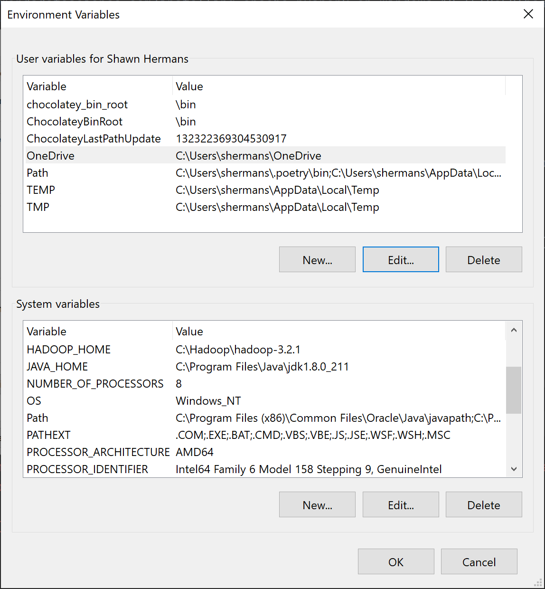

# Windows

!!! warning "Documentation in Progress"
    Check back soon for more updates.
    
## Overview
    
There are multiple options available for installing Spark, Hadoop, TensorFlow, and other Big Data/Deep Learning software on Windows 10. While it is possible to install these packages and use these packages on Windows, I strongly urge you to heed the warning of François Chollet, author of [Deep Learning With Python][deep-learning-with-python]. 
    
> Whether you’re running locally or in the cloud, it’s better to be using a Unix workstation. Although it’s technically possible to use Keras on Windows (all three Keras backends support Windows), We don’t recommend it. In the installation instructions in appendix A, we’ll consider an Ubuntu machine. If you’re a Windows user, the simplest solution to get everything running is to set up an Ubuntu dual boot on your machine. It may seem like a hassle, but using Ubuntu will save you a lot of time and trouble in the long run.

## Package Manager

If you are using Windows as your primary development environment, I recommend using a package manager like [Chocolatey][chocolatey]. 

A package manager is a tool that automates the process of installing, updating, configuring, and removing computer programs. Package managers are commonly used on Unix and Linux distributions. Debian Linux systems, like Ubuntu, use `aptitude`. Red Hat and Fedora systems use `yum`.  `MacPorts` and `homebrew` are two popular package managers for macOS. 

Follow the [Chocolatey installation guide][chocolatey-install] to install the package manager on your system.  Once you have completed installing the package manager, you can install new software by running PowerShell as an administrator and using the `choco` command.  For example, the following commands will install the latest versions of Adobe Acrobat Reader, Google Chrome, and FireFox on your system. 

```shell 
choco install adobereader
choco install googlechrome
choco install firefox
```

You can upgrade all packages using `choco upgrade all` or upgrade individual packages using `choco upgrade firefox`.  Similarly, you can uninstall packages using `choco uninstall`. 

The following is a table of software you might find useful for this course. 

| Software                                   | Package Name      | 
|--------------------------------------------|-------------------|
| Anaconda Distribution (Python 3.x)         | anaconda3         |
| Git (Install)                              | git.install       |
| GitHub Desktop                             | github-desktop    |
| Graphviz                                   | graphviz          | 
| Hadoop                                     | hadoop            |
| Java Development Kit 8                     | jdk8              |
| JetBrains Toolbox App                      | jetbrainstoolbox  |
| JetBrains DataGrip                         | datagrip          |
| JetBrains PyCharm                          | pycharm           |
| JetBrains PyCharm Educational              | pycharm-edu       |
| JetBrains PyCharm (Community Edition) [^1] | pycharm-community |
| MikTeX                                     | miktex            |
| Pandoc                                     | pandoc            |
| Pandoc CrossRef                            | pandoc-crossref   |
| PostgreSQL                                 | postgresql        |
| Protocol Buffers                           | protoc            |
| Scala                                      | scala             |
| VirtualBox                                 | virtualbox        |


If you are interested to see what other packages are available, see [Chocolatey packages][chocolatey-packages] for a list of community maintained packages. 
    
## Installing Dependencies

### Option 1: Dual Booting Ubuntu

!!! warning "Documentation in Progress"
    Check back soon for more updates.

*Download latest Ubuntu ISO*

* [Ubuntu 18.04][ubuntu-download-1804]
* [Ubuntu 20.04][ubuntu-download-2004]

*Ubuntu Flavors*

* [Lubuntu][lubuntu]
* [Xubuntu][xubuntu] 
* [Ubuntu Budgie][ubuntu-budgie]
* [Ubuntu Mate][ubuntu-mate] 

### Option 2: Run Ubuntu in a Virtual Machine

!!! warning "Documentation in Progress"
    Check back soon for more updates.

Run on VirtualBox. 

### Option 3: Windows Linux Sub-System

You can install Ubuntu on Windows 10 using the Windows Subsystem for Linux.  See the [installation guide][wsl-install] for more information. 

### Option 4: Native Packages

!!! warning
    This option is prone to error and the instructor may not be able to help you troubleshoot your development environment. Use at your own risk. 

The following article provides instructions on how to [install PySpark on Windows 10][pyspark-windows10-install].

* Install Hadoop using Chocolatey
* Install JDK 8 via Chocolatey
* Download [Winutils][winutils]
* Copy 2.7.1 bin in `winutils` to hadoop-3.2.1/bin
* Download Spark (2.4.5 release, pre-built for Hadoop 2.7) at http://spark.apache.org/downloads.html
* Copy the decompressed Spark folders to `C:\Spark`
* Set the following environment variables

| Variable      | Value                              |
|---------------|------------------------------------|
| HADOOP_HOME   | C:\Hadoop\hadoop-3.2.1             |
| JAVA_HOME     | C:\Program Files\Java\jdk1.8.0_211 |
| SPARK_HOME    | C:\Spark                           |

#### Setting Environment Variables 

Go the `edit system environment variables` in your control panel. 


Under `System Properties -> Advanced` select `Environment Variables`. 


Change the environment variables for your user. 



[^1]: While you can use the community version of PyCharm, JetBrains offers free educational licenses for students and teachers. See [educational licenses][jetbrains-education] for more details.

[chocolatey]: https://chocolatey.org/
[chocolatey-install]: https://chocolatey.org/install
[chocolatey-packages]: https://chocolatey.org/packages
[deep-learning-with-python]: https://www.manning.com/books/deep-learning-with-python
[jetbrains-education]: https://www.jetbrains.com/community/education/
[lubuntu]: https://lubuntu.me/
[pyspark-windows10-install]: https://towardsdatascience.com/installing-apache-pyspark-on-windows-10-f5f0c506bea1
[ubuntu-budgie]: https://ubuntubudgie.org/
[ubuntu-download-1804]: http://releases.ubuntu.com/18.04/
[ubuntu-download-2004]: http://releases.ubuntu.com/20.04/
[ubuntu-mate]: https://ubuntu-mate.org/
[winutils]: https://github.com/steveloughran/winutils
[wsl-install]: https://docs.microsoft.com/en-us/windows/wsl/install-win10
[xubuntu]: https://xubuntu.org/
